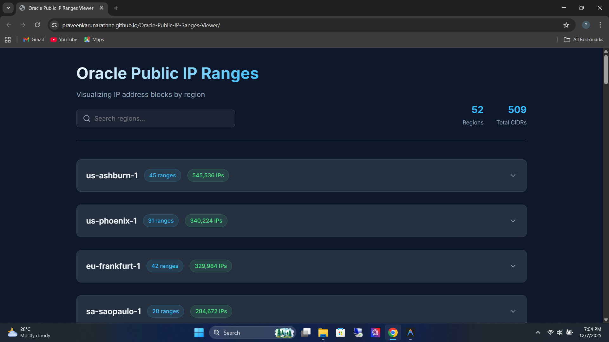
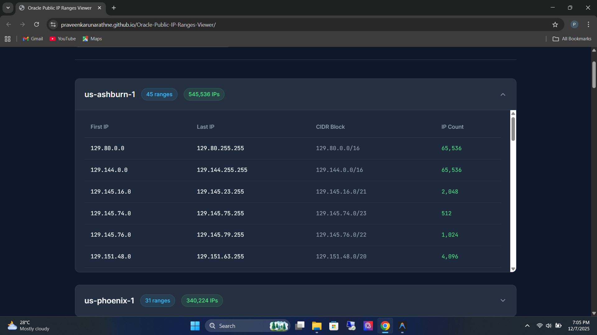

# Oracle Public IP Ranges Viewer


A modern, high-performance web dashboard for visualizing and exploring **Oracle Cloud Infrastructure (OCI)** public IP address blocks. This application fetches real-time data directly from Oracle, offering advanced filtering, searching, and CIDR-to-IP range calculations in a beautiful, responsive interface.

---

## 📑 Table of Contents

- [Features](#-features)
- [Demo](#-demo)
- [Getting Started](#-getting-started)
  - [Prerequisites](#prerequisites)
  - [Installation](#installation)
- [Usage](#-usage)
- [Project Structure](#-project-structure)
- [Technologies](#-technologies)
- [Contributing](#-contributing)
- [License](#-license)
- [Acknowledgments](#-acknowledgments)

---

## ✨ Features

- **🚀 Real-Time Synchronization**: Automatically fetches the latest `public_ip_ranges.json` from Oracle's official source.
- **🔍 Intelligent Search**: Instantly filter through dozens of regions with a real-time search bar.
- **📊 Smart Sorting & Filtering**:
  - Automatically filters for `OCI` tagged ranges.
  - Sorts regions by total IP count (High → Low) to highlight major infrastructure hubs.
- **🔢 Advanced CIDR Calculation**:
  - Converts CIDR blocks (e.g., `140.91.0.0/16`) into start/end IP addresses.
  - Calculates the exact number of hosts per block.
- **📱 Responsive Design**: Fully optimized for desktop, tablet, and mobile viewing with a clean, modern aesthetic.
- **⚡ High Performance**: Utilizing `DocumentFragment` and optimized DOM manipulation for smooth rendering of large datasets.

---

## 📷 Demo




---

## 🚀 Getting Started

Follow these instructions to get a copy of the project up and running on your local machine.

### Prerequisites

You need a modern web browser (Chrome, Firefox, Edge, Safari). No heavy backend is required.
To serve the files locally (to avoid CORS issues), you'll need a simple local server.

- **Python** (optional, for simple server)
- **Node.js** (optional, for `npx serve`)

### Installation

1.  **Clone the Repository**
    ```bash
    git clone https://github.com/yourusername/oracle-ip-ranges-viewer.git
    cd oracle-ip-ranges-viewer
    ```

2.  **Run Locally**
    *Using Python 3:*
    ```bash
    python -m http.server 8000
    ```
    *Using Node.js:*
    ```bash
    npx serve .
    ```

3.  **Access the Dashboard**
    Open your browser and navigate to:
    `http://localhost:8000`

---

## 💡 Usage

1.  **View Regions**: Upon loading, the dashboard displays text summaries of all OCI regions.
2.  **Expand Details**: Click on any **Region Card** to expand it and view the granular table of CIDR blocks and IP ranges.
3.  **Search**: Use the search input at the top to find specific regions (e.g., "Ashburn", "London").
4.  **Refresh Data**: Reload the page to fetch the absolute latest data from Oracle.

---

## 📂 Project Structure

```bash
oracle-ip-ranges-viewer/
├── index.html      # Main application structure and layout
├── style.css       # CSS3 styling, variables, and animations
├── script.js       # Core logic: Fetching, JSON parsing, and DOM rendering
├── README.md       # Project documentation
└── LICENSE         # GNU General Public License v3.0
```

---

## 🛠 Technologies

- **HTML5**: Semantic markup.
- **CSS3**: Custom properties (variables), Flexbox, CSS Grid, and Keyframe animations.
- **JavaScript (ES6+)**: Async/Await, Fetch API, and efficient array processing.
- **Google Fonts**: Inter & JetBrains Mono.

---

## 🤝 Contributing

Contributions are what make the open-source community such an amazing place to learn, inspire, and create. Any contributions you make are **greatly appreciated**.

1.  Fork the Project
2.  Create your Feature Branch (`git checkout -b feature/AmazingFeature`)
3.  Commit your Changes (`git commit -m 'Add some AmazingFeature'`)
4.  Push to the Branch (`git push origin feature/AmazingFeature`)
5.  Open a Pull Request

---

## 📝 License

Distributed under the **GPLv3** License. See `LICENSE` for more information.

---

## 🙏 Acknowledgments

- Data provided by [Oracle Cloud Infrastructure](https://docs.oracle.com/en-us/iaas/tools/public_ip_ranges.json).
- Icons provided by [Lucide](https://lucide.dev/) (or similar SVG set used).
- Fonts by [Google Fonts](https://fonts.google.com/).
